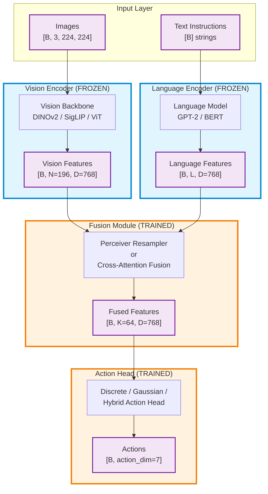
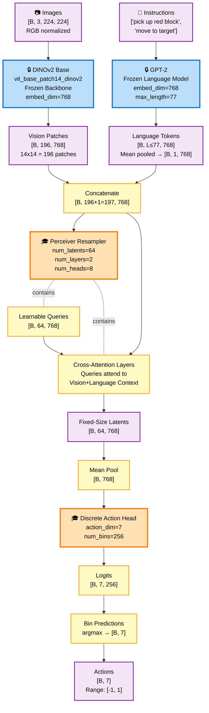
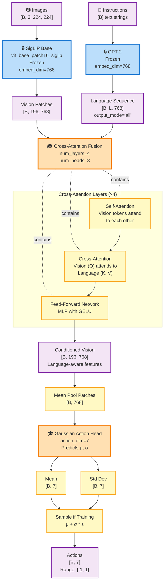
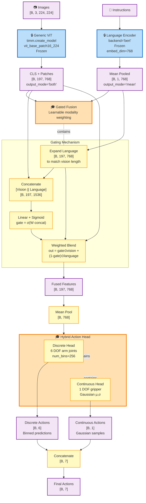
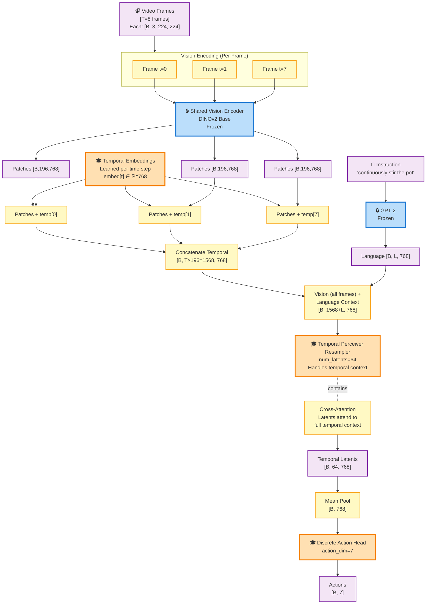
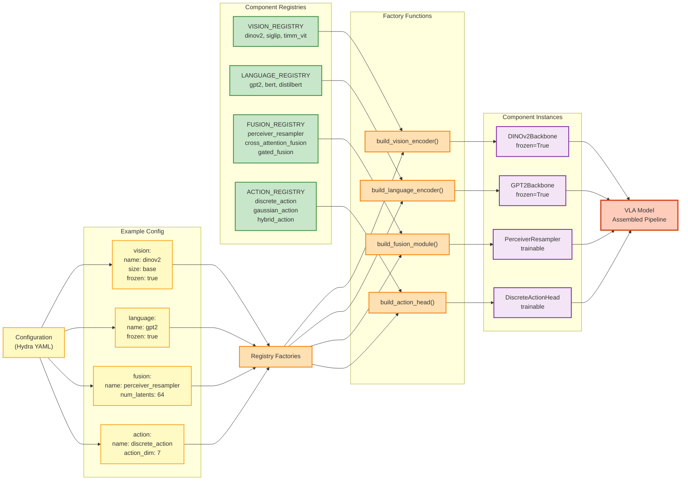
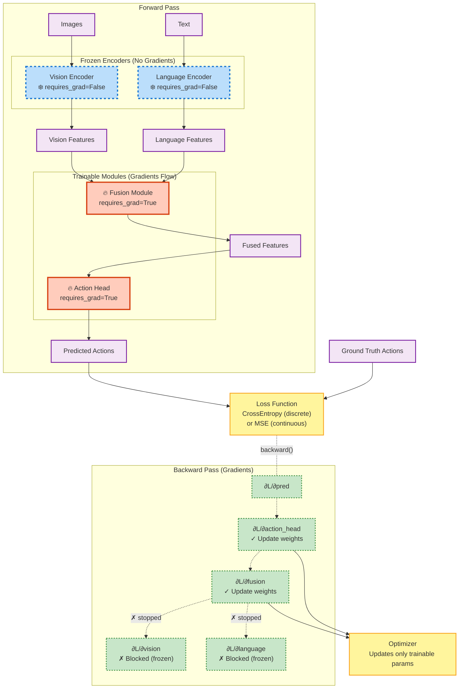

# VLA Model Architecture Diagrams

This document visualizes different Vision-Language-Action (VLA) model architecture combinations using Mermaid.js diagrams. Each diagram shows the complete data flow through components.

---

## 1. Complete VLA Pipeline Overview

This diagram shows the high-level data flow through the VLA system with all major components.

---

## 2. Architecture 1: DINOv2 + GPT-2 + Perceiver + Discrete Actions

The most common configuration used in RT-2 and OpenVLA.

---

## 3. Architecture 2: SigLIP + GPT-2 + Cross-Attention Fusion + Gaussian Actions

Language-conditioned vision with continuous action predictions.

---

## 4. Architecture 3: Generic ViT + Language Encoder + Gated Fusion + Hybrid Actions

Flexible configuration with mixed discrete/continuous actions.

---

## 5. Temporal Architecture: Multi-Frame VLA with Temporal Perceiver

Processes video sequences for temporally-aware action prediction.

---

## 6. Component Registry Pattern

Shows how components are assembled via the registry system.

---

## 7. Training Data Flow

Shows how gradients flow during training (frozen vs trainable components).

---

## Summary Table

| Architecture | Vision | Language | Fusion | Action | Use Case |
|--------------|--------|----------|--------|--------|----------|
| **Arch 1** | DINOv2 | GPT-2 | Perceiver | Discrete | RT-2 style, robust binning |
| **Arch 2** | SigLIP | GPT-2 | Cross-Attn | Gaussian | Continuous control, uncertainty |
| **Arch 3** | Generic ViT | BERT | Gated | Hybrid | Mixed discrete/continuous |
| **Arch 4** | DINOv2 | GPT-2 | Temporal Perceiver | Discrete | Video/multi-frame tasks |

---

## Key Design Principles

### 🔒 Frozen Components (Transfer Learning)
- **Vision Encoders**: Pretrained on ImageNet/vision tasks, weights frozen
- **Language Encoders**: Pretrained on text corpora, weights frozen
- **Why**: Leverage strong pretrained representations without catastrophic forgetting

### 🔥 Trainable Components (Task-Specific)
- **Fusion Modules**: Learn how to combine vision + language for robotics
- **Action Heads**: Learn action space mapping specific to robot/task
- **Why**: Adapt multimodal understanding to action prediction

### 📊 Fixed-Size Bottleneck
- Fusion modules compress variable-length inputs (196 vision patches + variable text length) into fixed-size latents (e.g., 64 tokens)
- Enables consistent downstream processing regardless of input size
- Perceiver architecture is particularly effective for this compression

### 🎯 Action Representation
- **Discrete (Binned)**: More stable training, used in RT-2/OpenVLA, 256 bins per dimension
- **Gaussian (Continuous)**: Enables stochastic policies, uncertainty quantification
- **Hybrid**: Best of both worlds for mixed action spaces

---

## Notes

- All diagrams use the default batch size `B` and common dimensions from the codebase
- Vision features typically have `N=196` patches (14×14 grid for 224×224 images with patch size 16)
- Language features have variable length `L` (up to 77 tokens for GPT-2 in this implementation)
- Fusion outputs are typically 64 latent tokens of dimension 768
- Action dimension is 7 for standard robotic arms (6 DOF + gripper)

Generated with Mermaid.js v11 syntax for tinyVLA project documentation.
